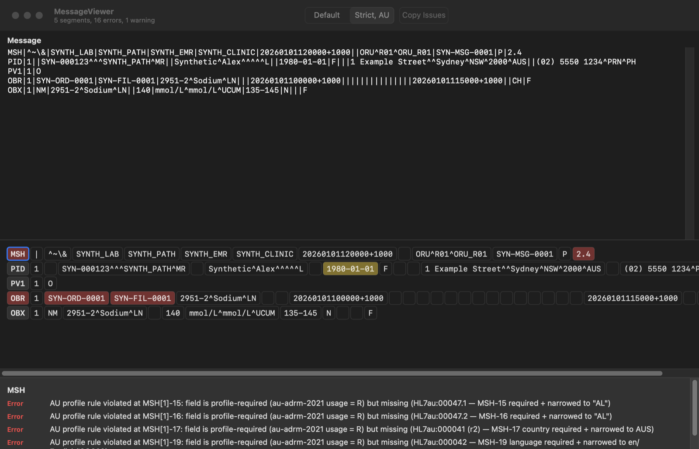

# Examples

Two programs that use the package as a consumer would. Both parse one synthetic v2.4 ORU^R01 (no real identifiers) and validate it under the default preset and under strict AU.

## QuickStart

`swift run QuickStart`, any platform. A console walk-through in `QuickStart/main.swift`: parse, read a value by path and by typed accessor, validate, print the issue counts, round-trip the bytes and build the ACK. The README and the Getting Started article quote it, and a test runs the same steps.

## MessageViewer

`swift run MessageViewer`, macOS only (SwiftUI). A window with the message above and a grid below: one row per segment, one cell per field, tinted yellow for a warning and red for an error. The pane under the grid names the cell under the pointer and lists its issues; the title bar counts segments, errors and warnings. The toolbar switches between the default preset and strict AU. File > Open reads a message file; Edit > Copy Issues puts every issue on the clipboard, one line each.

The grid model (`MessageViewer/CellGrid.swift`) is plain Swift and tested; it maps each `IssueLocation` onto a row by segment occurrence and a cell by field number, which is how any consumer maps a report back onto a message.
